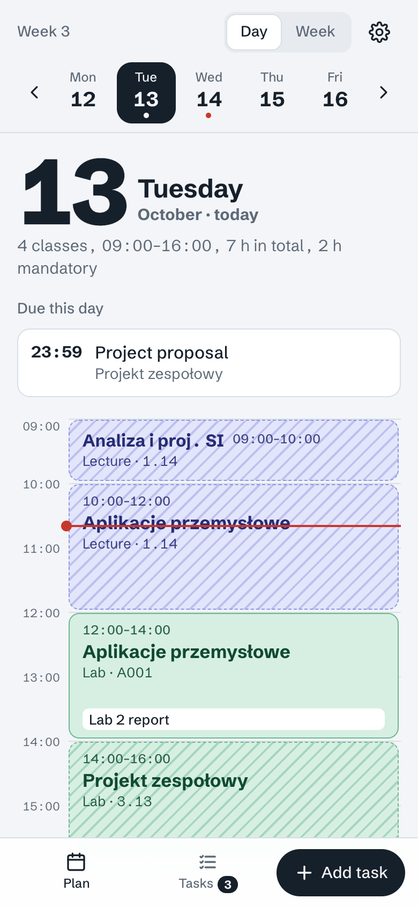
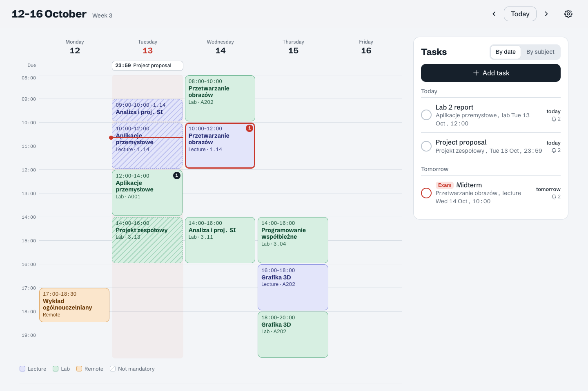

# Plan zajęć

Personal class timetable with subject tasks and push reminders. Built for an iPhone home-screen app and a desktop browser.

- **Phone:** day view (swipe between days), compact week view, task list.
- **Desktop:** week grid with the task list beside it.
- **Tasks:** assignments or exams, due *at a class* (picked from upcoming classes of that subject) or *on a date*. Each task has its own reminders, e.g. 2 and 1 days before, delivered at the configured time of day (default 18:00).
- **Notifications:** Web Push from a Cloudflare Worker cron (every 15 minutes).

<p>
  
  
</p>

## How it fits together

```
public/            static app (no build step): index.html, app.js, styles.css, sw.js, manifest, icons
src/index.ts       Worker: JSON API (Hono) + cron handler
src/schedule.ts    expands data/schedule.json into dated classes (biweekly, breaks, swapped days)
src/reminders.ts   reminder times ("N days before at 18:00", Europe/Warsaw)
src/push.ts        Web Push: VAPID (RFC 8292) + aes128gcm payload encryption (RFC 8291), WebCrypto only
src/auth.ts        Cloudflare Access JWT check for /api/*
data/schedule.json the timetable — the file to edit when the plan changes
scripts/           check-tasks.ts (open tasks vs. the timetable, runs before deploy), vapid.mjs (key pair)
migrations/        D1 schema (tasks, reminders, push subscriptions, settings)
```

Tasks, reminders and settings live in D1. The timetable lives in `data/schedule.json` and is bundled into the Worker, so a timetable change is a commit and a deploy.

## Editing the timetable

`data/schedule.json`:

- `semester`: teaching period, exam session, `breaks`, `daysOff`, and `swaps` (days that follow another weekday's timetable).
- `subjects`: `id`, `abbr` (shown in the narrow week view), `name`, `short`.
- `sessions`: one per recurring class. `day` is 1 = Monday … 5 = Friday. Set `"every": 2` and an `anchor` date for every-other-week classes, `"remote": true` for online ones, and `"mandatory": false` to show a class striped.
- `pending`: subjects whose times aren't known yet.

Changing a session's `id` or day orphans tasks that were due at its classes (they keep their date and time but lose the link to the class), and changing its start time leaves them at the old time. `npm run deploy` checks for this first (see below) and stops if any open task would be affected.

## Local development

```sh
npm install
npm run vapid > .dev.vars                     # local push keys
echo 'VAPID_SUBJECT=mailto:you@example.com' >> .dev.vars
echo 'AUTH_DISABLED=1' >> .dev.vars           # local only: skip the Cloudflare Access check
npm run db:migrate:local
npm run dev                                   # http://localhost:8787
npm test                                      # unit tests
npm run typecheck
npm run check-tasks -- --local                # open tasks vs. the timetable, local database
```

`npm run deploy` first runs the tests, the typecheck and `npm run check-tasks` against the remote database; any failure stops the deploy.

After changing anything in `public/`, bump `VERSION` in `public/sw.js`, or installed apps keep showing the previous version for one more launch.

Push works on `localhost` in desktop Chrome/Edge/Firefox. Trigger the cron by hand with `curl "http://localhost:8787/__scheduled?cron=*/15+*+*+*+*"` while `wrangler dev --test-scheduled` is running.

## First deploy

```sh
npx wrangler login
npx wrangler d1 create plan-zajec             # put the printed database_id into wrangler.jsonc
npm run db:migrate:remote
npm run vapid                                 # put VAPID_PUBLIC_KEY into wrangler.jsonc vars
npx wrangler secret put VAPID_PRIVATE_KEY     # paste the private key
# set VAPID_SUBJECT in wrangler.jsonc to a real mailto: address
npm run deploy
```

Keep the same VAPID key pair forever: changing it invalidates every existing push subscription.

### Lock it down with Cloudflare Access

1. Zero Trust dashboard → Access → Applications → add a self-hosted app for the Worker's hostname, with a policy allowing only your email.
2. Copy the application's AUD tag and your team domain (`<team>.cloudflareaccess.com`).
3. Add `ACCESS_TEAM_DOMAIN` and `ACCESS_AUD` to `vars` in `wrangler.jsonc` and deploy. The API rejects requests without a valid Access token, including requests to the `*.workers.dev` URL. Without these two variables it rejects every request, so the app only works once Access is set up (`AUTH_DISABLED=1` in `.dev.vars` is for local dev only and must never be set on the deployed Worker). Consider turning `workers_dev` off once a custom domain is set.

## On the iPhone

1. Open the app in Safari and sign in through Access.
2. Share → Add to Home Screen.
3. Open **Plan** from the Home Screen → Settings → Turn on notifications → Send test notification.

iOS only delivers Web Push to home-screen apps (iOS 16.4+).
